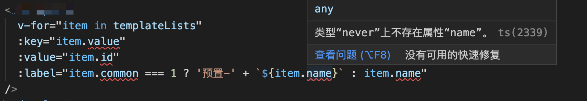
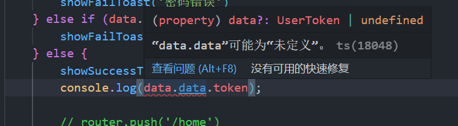
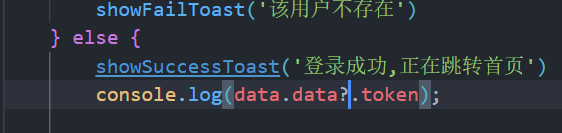

# TS 常见问题

## 1.类型“never”上不存在属性“xxx”

`vue3` + `ts` 语法报错：类型`never`上不存在属性`name`
<br/>
错误代码：




修改：

```ts
const templateLists = ref([] as any[])
```

## 2.xxx 可能为未定义


加个问号


## 3.引用 window 自定义变量以及 ts 在 window 上自定义变量数据类型报错的解决方案

### 问题描述

举个例子，在`TypeScript`中，当我们需要给 window 对象添加全局变量（如 testName），或者需要使用 window 下自定义创建的变量（以 testName 为例）。会出现以下 ts 报错：类型“Window & typeof globalThis”上不存在属性“testName”。产生类型报错的原因是因为 window 数据类型定义如下：

```ts
declare var window: Window & typeof globalThis
```

### 解决方案

1、增加自定义属性声明，在类型声明文件`typings.d.ts`中，增加如下声明

```ts
interface Window {
    testName: string
}
```

2、将 window 类型强制转换为 any

```js
(window as any).testName
```

3、使用方括号

```ts
window['testName']
```
