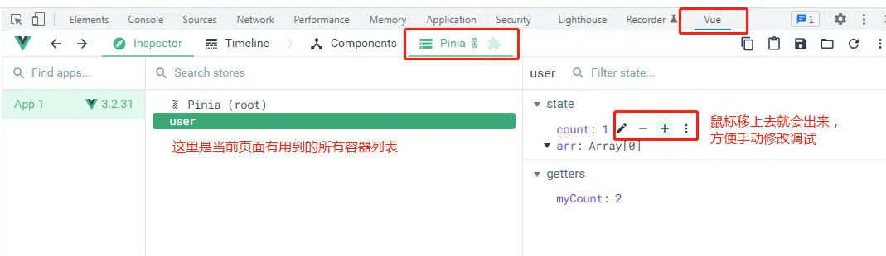

# Pinia 状态管理

Pinia 是 Vue.js 团队成员专门为 Vue 开发的一个全新的状态管理库，并且已经被纳入官方[github](https://github.com/vuejs/pinia)。

## 1.Pinia 和 Vuex

<font size=4 color=#7379f4 ><b>Vuex</b></font>：`State`、`Gettes`、`Mutations`(同步)、`Actions`(异步)
<br />

<font size=4 color=#7379f4 ><b>Pinia</b></font>：`State`、`Gettes`、`Actions`(同步异步都支持)
<br />

Vuex 当前最新版是 `4.x`

- Vuex4 用于 Vue3
- Vuex3 用于 Vue2

Pinia 当前最新版是 `2.x`

- 即支持 Vue2 也支持 Vue3

就目前而言 Pinia 比 Vuex 好太多了，解决了 Vuex 的很多问题，所以笔者也非常建议直接使用 Pinia，尤其是 TypeScript 的项目

## 2.Pinia 核心特性

- Pinia 没有 `Mutations`
- `Actions` 支持同步和异步
  <br /><br />
- 没有模块的嵌套结构
  - Pinia 通过设计提供扁平结构，就是说每个 store 都是互相独立的，谁也不属于谁，也就是扁平化了，更好的代码分割且没有命名空间。当然你也可以通过在一个模块中导入另一个模块来隐式嵌套 store，甚至可以拥有 store 的循环依赖关系
    <br /><br />
- 更好的 `TypeScript` 支持
  - 不需要再创建自定义的复杂包装器来支持 TypeScript 所有内容都类型化，并且 API 的设计方式也尽可能的使用 TS 类型推断
    <br /><br />
- 不需要注入、导入函数、调用它们，享受自动补全，让我们开发更加方便
- 无需手动添加 store，它的模块默认情况下创建就自动注册的
- Vue2 和 Vue3 都支持, 除了初始化安装和 SSR 配置之外，两者使用上的 API 都是相同的
  <br /><br />
- 支持 `Vue DevTools`
  - 跟踪 `actions`, `mutations` 的时间线
  - 在使用了模块的组件中就可以观察到模块本身
  - 支持 time-travel 更容易调试
  - 在 Vue2 中 Pinia 会使用 Vuex 的所有接口，所以它俩不能一起使用
  - 但是针对 Vue3 的调试工具支持还不够完美，比如还没有 time-travel 功能
    <br /><br />
- 模块热更新
  - 无需重新加载页面就可以修改模块
  - 热更新的时候会保持任何现有状态
    <br /><br />
- 支持使用插件扩展 Pinia 功能
- 支持服务端渲染

## 3.Pinia 使用

以 `Vue3 + TypeScript` 为例

安装

```shell
npm install pinia
```

`main.ts` 初始化配置

```ts
import { createPinia } from "pinia";
createApp(App).use(createPinia()).mount("#app");
```

在 store 目录下创建一个 `user.ts` 为例，我们先定义并导出一个名为 `user` 的模块

```ts
import { defineStore } from 'pinia'
export const userStore = defineStore('user', {
    state: () => {
        return {
            count: 1,
            arr: []
        }
    },
    getters: { ... },
    actions: { ... }
})
```

`defineStore` 接收两个参数
第一个参数就是模块的名称，必须是唯一的，多个模块不能重名，Pinia 会把所有的模块都挂载到根容器上
第二个参数是一个对象，里面的选项和 Vuex 差不多

- 其中 `state` 用来存储全局状态，它必须是箭头函数，为了在服务端渲染的时候避免交叉请求导致的数据状态污染所以只能是函数，而必须用箭头函数则为了更好的 TS 类型推导
- `getters` 就是用来封装计算属性，它有缓存的功能
- `actions` 就是用来封装业务逻辑，修改 `state`

### 访问 state

比如我们要在页面中访问 `state` 里的属性 count

由于 `defineStore` 会返回一个函数，所以要先调用拿到数据对象，然后就可以在模板中直接使用了

如下这样通过 `store.xxx` 使用，是具备响应式的

```vue
<template>
  <div>{{ store.count }}</div>
</template>
<script lang="ts" setup>
import { userStore } from "../store";
const store = userStore();
// 解构
// const { count } = userStore()
</script>
```

比如像注释中的解构出来使用，也可以用，只是这样拿到的数据**不是响应式**的，如果要解构还保持响应式就要用到一个方法 `storeToRefs()`，示例如下

原因就是 Pinia 其实是把 state 数据都做了 `reactive` 处理，和 Vue3 的 `reactive` 同理，解构出来的也不是响应式，所以需要再做 `ref` 响应式代理

### getters

这个和 Vuex 的 `getters` 一样，也有缓存功能。如下在页面中多次使用，第一次会调用 `getters`，数据没有改变的情况下之后会读取缓存

```vue
<template>
  <div>{{ myCount }}</div>
  <div>{{ myCount }}</div>
  <div>{{ myCount }}</div>
</template>
```

注意两种方法的区别

```ts
getters: {
    // 方法一，接收一个可选参数 state
    myCount(state){
        console.log('调用了') // 页面中使用了三次，这里只会执行一次，然后缓存起来了
        return state.count + 1
    },
    // 方法二，不传参数，使用 this
    // 但是必须指定函数返回值的类型，否则类型推导不出来
    myCount(): number{
        return this.count + 1
    }
}。
```

### 更新和 actions

更新 state 里的数据有四种方法，先看三种简单的更新

```vue
<template>
  <div>{{ user_store.count }}</div>
  <button @click="handleClick">按钮</button>
</template>
<script lang="ts" setup>
import { userStore } from "../store";
const user_store = userStore();
const handleClick = () => {
  // 方法一
  user_store.count++;

  // 方法二，需要修改多个数据，建议用 $patch 批量更新，传入一个对象
  user_store.$patch({
    count: user_store.count1++,
    // arr: user_store.arr.push(1) // 错误
    arr: [...user_store.arr, 1], // 可以，但是还得把整个数组都拿出来解构，就没必要
  });

  // 使用 $patch 性能更优，因为多个数据更新只会更新一次视图

  // 方法三，还是$patch，传入函数，第一个参数就是 state
  user_store.$patch((state) => {
    state.count++;
    state.arr.push(1);
  });
};
</script>
```

第四种方法就是当逻辑比较多或者请求的时候，我们就可以封装到示例中 store/user.ts 里的 `actions` 里

可以传参数，也可以通过 `this.xx` 可以直接获取到 `state` 里的数据，需要注意的是不能用箭头函数定义 `actions`，不然就会绑定外部的 `this` 了

```ts
actions: {
    changeState(num: number){ // 不能用箭头函数
        this.count += num
    }
}
```

调用

```ts
const handleClick = () => {
  user_store.changeState(1);
};
```

## 4.支持 VueDevtools

打开开发者工具的 `Vue Devtools` 就会发现 Pinia，而且可以手动修改数据调试，非常方便



## 5.模拟调用接口

示例：

先定义示例接口 api/user.ts

```ts
// 接口数据类型
export interface userListType {
  id: number;
  name: string;
  age: number;
}
// 模拟请求接口返回的数据
const userList = [
  { id: 1, name: "张三", age: 18 },
  { id: 2, name: "李四", age: 19 },
];
// 封装模拟异步效果的定时器
async function wait(delay: number) {
  return new Promise((resolve) => setTimeout(resolve, delay));
}
// 接口
export const getUserList = async () => {
  await wait(100); // 延迟100毫秒返回
  return userList;
};
```

然后在 store/user.ts 里的 `actions` 封装调用接口

```ts
import { defineStore } from "pinia";
import { getUserList, userListType } from "../api/user";
export const userStore = defineStore("user", {
  state: () => {
    return {
      // 用户列表
      list: [] as userListType, // 类型转换成 userListType
    };
  },
  actions: {
    async loadUserList() {
      const list = await getUserList();
      this.list = list;
    },
  },
});
```

页面中调用 `actions` 发起请求

```vue
<template>
  <ul>
    <li v-for="item in user_store.list">...</li>
  </ul>
</template>
<script lang="ts" setup>
import { userStore } from "../store";
const user_store = userStore();
user_store.loadUserList(); // 加载所有数据
</script>
```

## 6.跨模块修改数据

在一个模块的 `actions` 里需要修改另一个模块的 `state` 数据

示例：比如在 chat 模块里修改 user 模块里某个用户的名称

```ts
// chat.ts
import { defineStore } from "pinia";
import { userStore } from "./user";
export const chatStore = defineStore("chat", {
  actions: {
    someMethod(userItem) {
      userItem.name = "新的名字";
      const user_store = userStore();
      user_store.updateUserName(userItem);
    },
  },
});
```

user 模块里

```ts
// user.ts
import { defineStore } from "pinia";
export const userStore = defineStore("user", {
  state: () => {
    return {
      list: [],
    };
  },
  actions: {
    updateUserName(userItem) {
      const user = this.list.find((item) => item.id === userItem.id);
      if (user) {
        user.name = userItem.name;
      }
    },
  },
});
```
